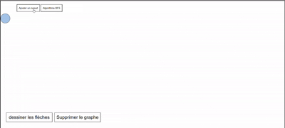
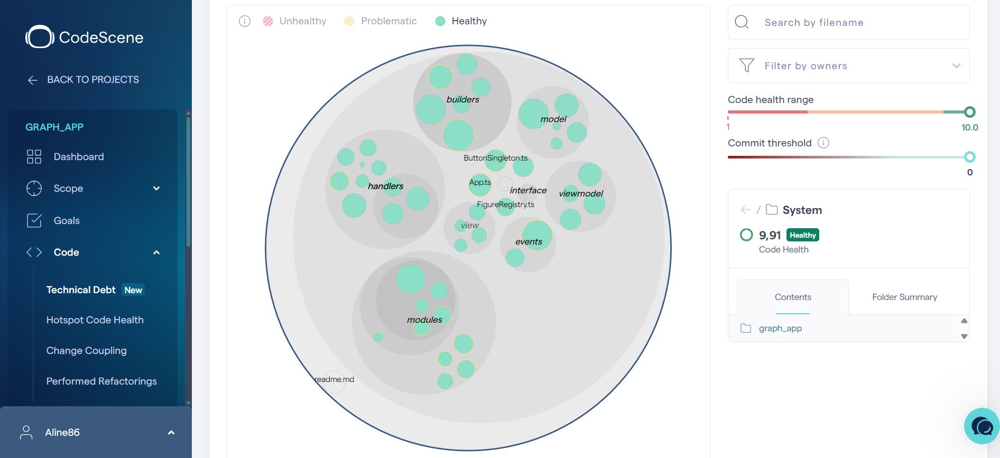

# Architecture — Editeur de graphes


## Introduction

Ce projet est un éditeur de graphes qui se veut modulaire grâce au câblage de nouveaux algorithmes sans toucher le code centralisé d'édition de graphes. Il est ainsi possible de créer un graphe manuellement et de lancer un algorithme dessus.
Le projet est en construction, pour le moment le noeud de départ est calculé en fonction de son nombre d'arêtes associées.
Pour avoir une arrête bidirectionnelle, il s'agit de créer l'arête aller et l'arête retour.

Le graphe s'enregistre dans la session du navigateur.

## Démo

🔗 <a href="https://graph-app-kappa.vercel.app/" target="_blank">Voir la démo en ligne</a>



## Qualité de code :


CodeScene :

## 

## Architecture MVVM

### Module

Point d'entrée de chaque fonctionnalité. Il enregistre les actions disponibles et câble tous les composants ensemble (`install`). C'est l' endroit où les dépendances et les actions sont assemblées.

```
GraphModule
  ├── ArrowModule
  └── NodeModule
```

### ViewModel

Contient la logique métier. Il lit et mute le modèle, puis dispatche des événements sur l'event bus créé à base de CustomEvents injectés dans EventTarget natif de javascript. Il ne touche jamais le DOM.

### Handler

Réagit aux actions utilisateur (clics, node dragging). Il appelle le ViewModel et ne touche pas le DOM directement.

### DomBuilder

Responsable des mutations DOM, il écoute l'event bus et met à jour l'affichage.

### View

Orchestre les trois précédents. Elle instancie, câble, et ne stocke rien d'autre que ce dont le Module a besoin après construction.

---

## Le bus d'événements

Toutes les couches communiquent via un event bus partagé (`CustomEvents extends EventTarget`). Il n'y a pas de communication directe.

```
ViewModel  →  dispatch("node:position:update")
                        ↓
DomBuilder ←  addEventListener("node:position:update")
```

Les modules existants reçoivent `CustomEvents` en paramètre — ils acceptent donc `AlgorithmEvents` sans modification.

---

## Le FigureRegistry

Registre statique qui mappe des identifiants d'actions à des handlers. Les ids sont des identifiants de **catégorie** (`node_events`, `arrow_events`) associé à l'identifiant de l'instance de graphe auquel le bouton et son action associée doivent se rattacher.

---

## MVVM plutôt que MVC

Il est difficile de scinder les évènements des éléments dom avec une structure MVC, on arrive rapidement à un modèle hybride et difficilement maintenable. Plus adapté si on veut rajouter des fonctionnalités liées aux évènementx si on ne veut pas mélanger logique associée aux évènements dom et affichage des éléments.

---

## Ajouter un algorithme

1. Créer un `NouveauModule implements Module`
2. Utiliser `AlgorithmEvents extends CustomEvents` pour les nouveaux événements
3. Dispatcher sur le bus
4. Regarder la structure

```
GraphAlgorithmModule
  ├── BFSModule
  └── VotreNouveauModule
```

## Justifications des choix techniques :

- J'ai choisi d'utiliser un bus d'évènements plutôt qu'un store pour trigger et dispactcher les évènements DOM car un store gère l'état interne de l'app. Le store mute les valeurs alors que le bus génère juste un évènement de reaction, le store aurait mélangé les responsabilités et le code également par conséquent.

- J'ai choisi un découplage modulaire pour ne pas à avoir à toucher à la logique de création et d'édition de graphe lorsque je rajoute des algorithmes, l'objectif c'est de pouvoir rajouter plein de modules sans toucher à la logique centralisée.

- Mon prochain chantier de travail sera de finir de découpler totalement la logique dom de la logique des view model notamment pour que ce soit testable plus facilement, que les doms builders ne connaissent pas du tout les models même si ils ont besoin d'afficher les informations contenues dans les instances.

## Limitations actuelles vouées à modications futures

Ecrire des tests

Refacto Dom View Models par endroits

Réécrire logique Arrow Position pour que les calculs de position soient relatifs au container et non au viewport
